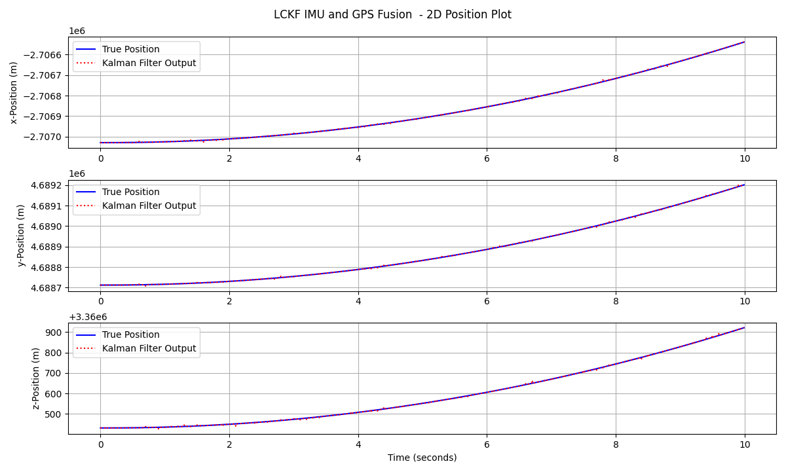
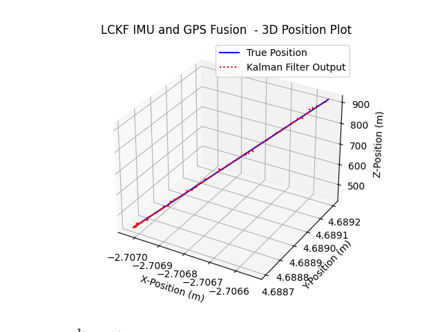

# Kalman Filter for GPS and IMU Fusion (Loose Coupling Technique)

This repository implements a **loose coupling technique** for fusing GPS and IMU data using a Kalman Filter (LCKF) to estimate the 3D position of a moving object. In loose coupling, GPS and IMU data are treated separately, with GPS providing position updates at lower frequencies and IMU providing high-frequency motion data. The Kalman filter combines these data sources to provide a smooth and accurate position estimate over time.

## Project Structure

- **globals.py**: Contains global constants and configuration parameters such as sample frequencies, file paths, noise values, etc.
- **run.py**: Main script to run the Kalman filter. It loads data, initializes the filter, and performs the prediction and update steps.
- **KalmanFilter.py**: Implements the Kalman filter logic, including prediction and update steps.
- **Data Folders**:
  - `Path-1`: Simulates a constant velocity motion scenario.
  - `Path-2`: Simulates a dynamic motion scenario.

Each folder contains:
  - `accel.csv`: IMU acceleration data (ax, ay, az) in m/s².
  - `imu_pos.csv`: IMU position data in ECEF (x, y, z).
  - `gps.csv`: GPS position data in ECEF (x, y, z).
  - `true_pos.csv`: Ground truth position data (reference).
  - `time.csv`: Time stamps for each data point.

## How It Works

1. **Loose Coupling Technique**: 
   - The Kalman filter uses the loose coupling technique, where the GPS and IMU data are combined independently. The IMU data (acceleration or position) is processed continuously to predict position and velocity, while GPS data is used intermittently to correct the IMU-predicted state.
   
2. **Global Settings**: The `globals.py` file defines key settings such as:
   - `filebase_path`: Path to the data files.
   - `imu_data_flag`: Determines if IMU data is position or acceleration.
   - `fs_imu` and `fs_gps`: Sampling frequencies of IMU and GPS data.
   - `R` and `Q`: Measurement and process noise values for the Kalman filter.

3. **Simulated Data**: 
   - `get_imu_data()`: Loads IMU data (either acceleration or position based on the `imu_data_flag`).
   - `get_gps_data()`: Loads GPS position data.
   - `get_true_position()`: Loads true (reference) position data.

4. **Kalman Filter**: 
   - The Kalman Filter estimates the position using a state vector represented by six axes: **[x, x_vel, y, y_vel, z, z_vel]**, where:
     - `x, y, z`: Position coordinates.
     - `x_vel, y_vel, z_vel`: Velocity along each respective axis.
   - `KalmanFilter`: The Kalman filter class is initialized with the initial state, noise covariances, and other parameters. It uses the constant velocity model for the state transition and fuses the IMU and GPS data using a prediction and update cycle.
   - `predict()`: Updates the position and velocity based on IMU data.
   - `update()`: Corrects the predicted state using GPS data at lower frequency.

5. **Visualization**: 
   - The results are visualized in both 2D (separate x, y, z axes) and 3D plots, comparing the true position with the Kalman filter estimates.

## Setup

### Prerequisites

- Python 3.x
- Required packages:
  ```bash
  pip install numpy matplotlib pandas
  ```

### Usage

1. Place your data files in the `Path-1` or `Path-2` folders as described above.
2. Configure the desired `filebase_path` and settings in `globals.py`.
3. Run the Kalman filter:
   ```bash
   python run.py
   ```
4. The script will display 2D and 3D plots showing the Kalman filter's estimated positions against the true positions.

## Example

Below are some example visualizations from the Kalman filter:

- **2D Position Plot**:



- **3D Position Plot**:



## Data Folders

- `Path-1`: Simulates a scenario with constant velocity motion.
- `Path-2`: Simulates a more dynamic motion scenario.

Each folder contains the necessary CSV files (`accel.csv`, `gps.csv`, `imu_pos.csv`, `true_pos.csv`, `time.csv`).

## Future Enhancements

- Implement more complex motion models for the Kalman filter (e.g., constant acceleration).
- Explore sensor fusion with other sensors (e.g., barometers or magnetometers).
- Test with real-world data.

## License

This project is licensed under the MIT License.

---